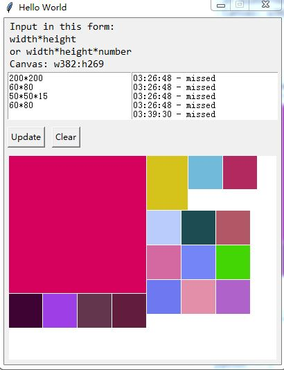

# bin packing

Just for fun.

requires:
	python >= 3.0
	pytest == 2.7.0
	Pillow == 2.7.0
	cx-Freeze == 4.3.4 # For creating executable

any enhance pull request will be accepted

## Usage

Run `python setup.py develop` to make the package locally available then you can run `python binpacking` to run the program or `py.test tests` to do the test.

Or, you can use `python -m binpacking` to run the program or `python tools/test.py` to do the test.

---

Copyright (c) 2015, Towry Wang
